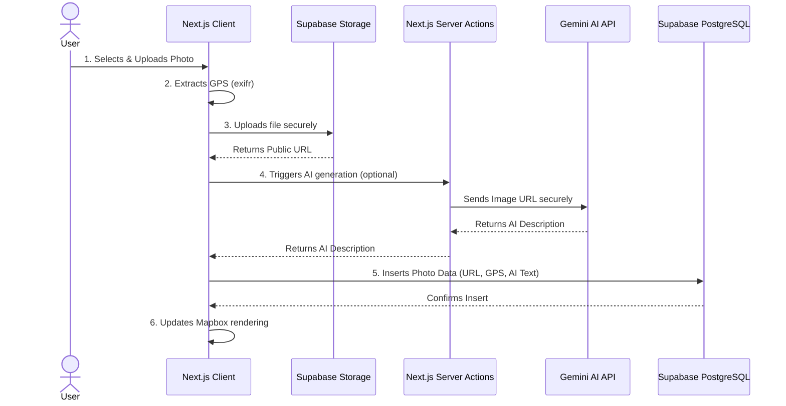

# HyLight Map App - Fullstack Technical Test

A full-stack web application built for the HyLight Technical Test. It allows users to sign up, upload geotagged photos, display them on an interactive Mapbox map, and add comments. It also features an AI integration that automatically generates a description of the uploaded image.

> **Note:** For the detailed technical architecture, trade-offs, and project plan (The Strategist), please see the [Notion Document](https://rocky-radon-069.notion.site/hylight-technical-test?pvs=73) _(<- Replace with your actual Notion link)_.

## 🚀 Features

- **Secure Authentication:** User sign-up and log-in powered by Supabase SSR. _(Note: Email verification is disabled for this MVP to allow for faster testing and immediate access)._
- **Geotagged Uploads:** Automatically extracts GPS coordinates (Latitude/Longitude) from uploaded photos on the client side.
- **High-Performance Map:** Uses Mapbox GL JS and native GeoJSON clustering to smoothly display and handle large datasets (tested for 10,000+ markers).
- **Interactive Comments:** Click on any map marker to view the image and engage in a comment thread with other users.
- **AI Image Descriptions (Optional Feature):** Seamless integration with Google Gemini 2.5 Flash to automatically generate a one-sentence description of uploaded photos.

## 🏗️ System Architecture & Data Flow

The following diagram explains the data flow from the moment a user uploads an image to when it appears on the map.



## 💻 Tech Stack

- **Frontend:** Next.js 16 (App Router), React 19, Tailwind CSS 4
- **Backend & Database:** Supabase (PostgreSQL, Auth SSR, Storage)
- **Map Integration:** Mapbox GL JS, `react-map-gl`
- **AI Integration:** Vercel AI SDK, Google Gemini 2.5 Flash
- **Utilities:** `exifr` (GPS extraction), `zod` (env validation)
- **Tooling:** `mise` (Node.js version management), ESLint, Prettier, Husky

## 🛠️ Getting Started (Local Development)

### Prerequisites

Ensure you have [mise](https://mise.jdx.dev/) installed, or use Node.js version specified in `.node-version` / `mise.toml`.

### 1. Clone the repository

```bash
git clone <your-repository-url>
cd hylight-map-app
```

### 2. Install dependencies

```bash
npm install
```

### 3. Environment Variables

Create a `.env.local` file in the root directory and add the following keys. You will need your own Supabase and Mapbox credentials.

```env
NEXT_PUBLIC_SUPABASE_URL=your_supabase_url
NEXT_PUBLIC_SUPABASE_PUBLISHABLE_KEY=your_supabase_anon_key
NEXT_PUBLIC_MAPBOX_ACCESS_TOKEN=your_mapbox_token
GOOGLE_GENERATIVE_AI_API_KEY=your_gemini_api_key
```

### 4. Database Setup

The database schema and policies are managed via Supabase Migrations.
Link your project and push the migrations to your Supabase instance:

```bash
npx supabase link --project-ref your_project_ref
npx supabase db push
```

### 5. Run the development server

```bash
npm run dev
```

Open [http://localhost:3000](http://localhost:3000) with your browser to see the result.

## 🔮 Future Scope

While this version satisfies the core end-to-end requirements, future iterations for a full production release would include:

- **Enable Email Verification:** Turn on email confirmations in Supabase for stricter user identity validation.
- **Image Optimization:** Implement server-side image compression (e.g., resizing before saving to Supabase Storage) to save bandwidth.
- **Component Refactoring:** Decouple the map logic into smaller custom hooks (`useMapMarkers`, etc.) to improve code maintainability as the application grows.
